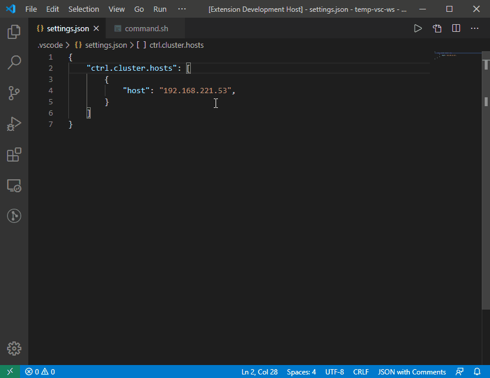
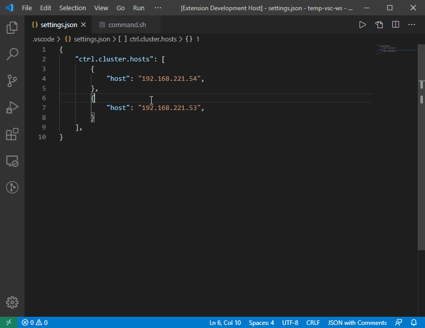

# SSH Cluster Control for Visual Studio Code

[](https://travis-ci.com/boceckts/vscode-ssh-cluster-control)
[](LICENSE)

Configure a cluster of ssh hosts and run terminal commands simultaneously on each node. This can be useful when dealing in a distributed environment and you need to manage multiple remote compute nodes. There are predefined commands available but you can also run completely custom commands. You can easily customize the extension to add a custom command prefix/suffix to each command execution on cluster and host level.

## Requirements

This extension requires **[OpenSSH](https://www.openssh.com/)** to be installed on your machine. Most Unix based systems (Linux and Mac Os X) provide it by default. On Windows you can install ssh via [Cygwin](https://www.cygwin.com/).

You can check if ssh is installed on your machine by typing `ssh` in your favourite system terminal.  
If it shows the usage information, you are ready to go.


## Features

- Configure a cluster of ssh hosts to run commands simultaneous on each node
- Open a ssh terminal for each host in the configured cluster
- Run custom terminal commands on each ssh host of the configured cluster
- Run selected text as a terminal command on each ssh host of the configured cluster
- Run one of the following predefined terminal commands on each ssh host of the configured cluster
    - initiate shutdown
    - initiate restart
    - show system info
    - show hardware info
    - show a list of running processes
    - show the free memory
    - show the current date
    - show the open ports
    - show the current working directory
    - list files in current directory
    - show the hostname
    - show the network configuration
- Configure a command prefix/postfix on cluster and ssh host level
- Supports commands for bash, cmd and powershell


## Usage

1. Configure a cluster of ssh hosts. See [Hosts Configuration](#Hosts-Configuration)
2. Press `F1` and search for *Cluster Ctrl* to run any available command.


3. Alternatively, you can select some text, perform a right click and select the menu item *Cluster Ctrl: Run Selection as Command*.



The status bar item indicates the status of the cluster and can be used to open up the output console.
Any output of the hosts of the cluster will be redirected to this view.
Additionally, you can define a command prefix and postfix which for example can be used to customize the command output.



## Extension Configuration

This section describes in detail how to configure a cluster of multiple ssh hosts for the extension and the additional configuration parameters that you can set.

### Hosts Configuration

Configure multiple ssh host by adding a [Host Definition](#Host-Definition) for each host to the `ctrl.cluster.hosts` list property in the settings (has to be edited in the settings file). A simple ssh host entry can look like this:
```
"ctrl.cluster.hosts": [
        {
            "host": "192.168.178.20"
        },
    ]
```
This requires that you have already configured your username and key file to be used for this ssh host in your ssh configuration file `~/.ssh/config`. Otherwise, you must add the `user` and `identityFile` properties. The detailed list of all supported properties of a ssh host entry can be seen in the following section.

### Host Definition

A host is defined by:

| key | type | required | description |
|--|--|--|--|
| `host` | `string` | yes | host address or hostname to be used for the ssh connection (ideally the same host is configured in `~/.ssh/config`) | no |
| `user` | `string` | no | username to be used for the ssh connection (overrides the User specified in `~/.ssh/config` if set) |
| `identityFile` | `string` | no | identity file to be used for the ssh connection (overrides the IdentityFile specified in `~/.ssh/config` if set) |
| `prefix` | `string` | no | set a prefix that will be prepended to every command of this particular host. |
| `suffix` | `string` | no | set a suffix that will be appended to every command of this particular host. |

### Contributed Settings

This extension contributes the following settings:

| setting id | default | type | description |
|--|--|--|--|
| `ctrl.cluster.name` | `"My Cluster"` | `string` | set cluster name to personalise your cluster. |
|`ctrl.cluster.timeout` | `5` | `number` | set the timeout for the ssh command. |
|`ctrl.cluster.flavor` | `"bash"` | `[bash, cmd, pwsh]` | set the flavor of the remote hosts shell. Select *bash* for Mac Os X or Linux, and select either *cmd* (Command Prompt) or *pwsh* (PowerShell) for Windows. |
|`ctrl.cluster.prefix` | `""` | `string` | set a prefix that will be prepended to the command string on every command execution on every host. |
|`ctrl.cluster.suffix` | `""` | `string` | set a suffix that will be appended to the command string on every command execution on every host. |
|`ctrl.cluster.hosts` | `[]` | `array` | the ssh hosts that make up your cluster. A list of [Host Definition](#Host-Definition)s. |
| `ctrl.cluster.commands.shutdown` | <code>{<br>&nbsp;"bash": "sudo shutdown now",<br>&nbsp;"cmd": "shutdown /s /t 0",<br>&nbsp;"pwsh": "Stop-Computer"<br>}</code> | `object` | Set the *initiate shutdown* command for each platform |
| `ctrl.cluster.commands.restart` | <code>{<br>&nbsp;"bash": "sudo shutdown -r now",<br>&nbsp;"cmd": "shutdown /r /t 0",<br>&nbsp;"pwsh": "Restart-Computer"<br>}</code> | `object` | Set the *initiate restart* command for each platform |
| `ctrl.cluster.commands.systemInfo` | <code>{<br>&nbsp;"bash": "uname -a",<br>&nbsp;"cmd": "ver",<br>&nbsp;"pwsh": "Get-CimInstance Win32_OperatingSystem"<br>}</code> | `object` | Set the *show systemInfo* command for each platform |
| `ctrl.cluster.commands.hardwareInfo` | <code>{<br>&nbsp;"bash": "lshw",<br>&nbsp;"cmd": "systeminfo",<br>&nbsp;"pwsh": "Get-ComputerInfo"<br>}</code> | `object` | Set the *show computer info* command for each platform |
| `ctrl.cluster.commands.processList` | <code>{<br>&nbsp;"bash": "ps aux",<br>&nbsp;"cmd": "tasklist",<br>&nbsp;"pwsh": "Get-Process"<br>}</code> | `object` | Set the *show process list* command for each platform |
| `ctrl.cluster.commands.memory` | <code>{<br>&nbsp;"bash": "free",<br>&nbsp;"cmd": "systeminfo | find \"\"Available Physical Memory\"\"",<br>&nbsp;"pwsh": "Get-CimInstance Win32_OperatingSystem \| Select FreePhysicalMemory"<br>}</code> | `object` | Set the *show memory* command for each platform |
| `ctrl.cluster.commands.date` | <code>{<br>&nbsp;"bash": "date",<br>&nbsp;"cmd": "date /T",<br>&nbsp;"pwsh": "Get-Date"<br>}</code> | `object` | Set the date command for each platform |
| `ctrl.cluster.commands.ports` | <code>{<br>&nbsp;"bash": "lsof -i",<br>&nbsp;"cmd": "netstat -an",<br>&nbsp;"pwsh": "Get-NetTCPConnection"<br>}</code> | `object` | Set the *show open ports* command for each platform |
| `ctrl.cluster.commands.workingDirectory` | <code>{<br>&nbsp;"bash": "pwd",<br>&nbsp;"cmd": "cd",<br>&nbsp;"pwsh": "Get-Location"<br>}</code> | `object` | Set the *show current directory* command for each platform |
| `ctrl.cluster.commands.listFiles` | <code>{<br>&nbsp;"bash": "ls -al",<br>&nbsp;"cmd": "dir",<br>&nbsp;"pwsh": "Get-ChildItem"<br>}</code> | `object` | Set the *list files* command for each platform |
| `ctrl.cluster.commands.hostname` | <code>{<br>&nbsp;"bash": "hostname",<br>&nbsp;"cmd": "hostname",<br>&nbsp;"pwsh": "$env:computername"<br>}</code> | `object` | Set the *show hostname* command for each platform |
| `ctrl.cluster.commands.networkConfiguration` | <code>{<br>&nbsp;"bash": "ip addr",<br>&nbsp;"cmd": "ipconfig /all",<br>&nbsp;"pwsh": "Get-NetIPConfiguration"<br>}</code> | `object` | Set the *show network configuration* command for each platform |

## Sample Configuration Snippets

This sections provides some sample configuration snippets that can be included in the `settings.json` file.

1. Prefix the command output of every node with their hostname:
    ```
    "ctrl.cluster.prefix": "echo -n \"[$(hostname)]\";"
    ```

2. Execute every command of a particular node in a specific directory:
    ```
    "ctrl.cluster.prefix": "echo -n \"[$(date +%D%T)] \";",
    "ctrl.cluster.hosts": [
        {
            "host": "192.168.178.20",
        },
        {
            "host": "192.168.178.30",
            "prefix": "cd ~/tmp && "
        },
    ]
    ```

3. Use `ifconfig` for the *show network configuration* command on Unix hosts:
    ```
    "ctrl.cluster.commands.networkConfiguration": {
        "bash": "ifconfig",
        "cmd": "ipconfig /all",
        "pwsh": "Get-NetIPConfiguration"
    }
    ```

4. Configure the cluster to use the powershell commands. Use this option if you have a cluster of Windows hosts that use powershell as default terminal:
    ```
    "ctrl.cluster.flavor": "pwsh"
    ```

5. Suppress any program errors of the ssh hosts when running a command on your cluster:
    ```
    "ctrl.cluster.suffix": " 2> /dev/null"
    ```


## Change Log

The Change Log can be found [here](CHANGELOG.md).

## Contributing

Fork the [repo](https://github.com/boceckts/vscode-ssh-cluster-control), create a branch and submit pull requests.
